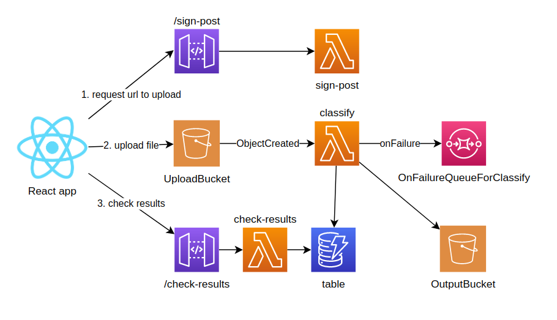

# Classify sensors

We have a fleet of vehicles equipped with sensors for `loudness`, `bumpiness`, and `happiness`. The vehicles upload a file with this format:

```text
reference loudness 5 bumpiness 10 happiness 5
loudness 184744bf-6439-4c9b-aeba-42e8fb6a214d
2007-04-05T22:00 3
2007-04-05T22:01 2
loudness f8aa668d-96b6-4f64-8179-505fa291ebd3
2007-04-05T22:00 8
2007-04-05T22:01 6
happiness 184744bf-6439-4c9b-aeba-42e8fb6a214d
2007-04-05T22:00 1
2007-04-05T22:01 2
happiness f8aa668d-96b6-4f64-8179-505fa291ebd3
2007-04-05T22:00 7
2007-04-05T22:01 9
bumpiness f8aa668d-96b6-4f64-8179-505fa291ebd3
2007-04-05T22:00 7
2007-04-05T22:01 9
```

The first line has some reference values, then for the following line, the first word is the sensor type (`loudness`, `bumpiness` or `happiness`) and the second word is the sensor `id` (in the example above `184744bf-6439-4c9b-aeba-42e8fb6a214d` and `f8aa668d-96b6-4f64-8179-505fa291ebd3`), then some timestamped values.

We have to process the file in order to classify each sensor, so for the above input we should get the following classification:

```json5
{
  "184744bf-6439-4c9b-aeba-42e8fb6a214d": [
    "loudness",
    "happiness"
  ],
  "f8aa668d-96b6-4f64-8179-505fa291ebd3": [
    "loudness",
    "happiness",
    "bumpiness"
  ]
}
```

# Architecture

<p align="center">
  
</p><br />

### Techs used in this backend
* Serverless Framework
* Node, TypeScript
* Jest
* Axios

AWS serverless:
* Lambda
* DynamoDB
* SQS
* S3
* API Gateway

CI/CD:
* GitHub Actions

# Frontend

In [this repo](https://github.com/s4nt14go/classify-sensors-front) you can take a look at the frontend and the demo app!

# Deployment instructions

1. Use Node 14 version as lambdas, using [nvm](https://github.com/nvm-sh/nvm) you can:

    ```
    # set Node 14 in current terminal
    nvm use 14
    # set Node 14 as default (new terminals will use 14)
    nvm alias default 14
    ```

1. Install dependencies

    ```shell script
    npm ci
    ```

1. Run unit tests

    ```shell script
    npm test
    ```

1. Deploy on `dev`

   Set up your AWS credentials for `dev` account and deploy:

    ```shell script
    npm run deploy
    ```

1. Run e2e tests

    ```shell script
    npm run exportEnv
    npm run e2e-test
    ```

1. Deploy on `prod`

   Set up your AWS credentials for `prod` account and deploy:

    ```shell script
    npm run deploy:prod
    ```
